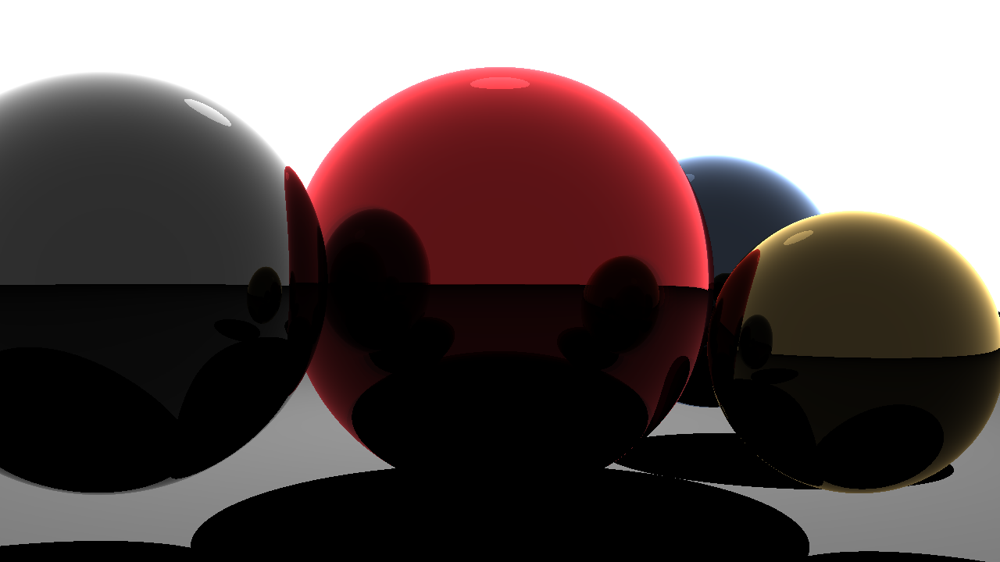
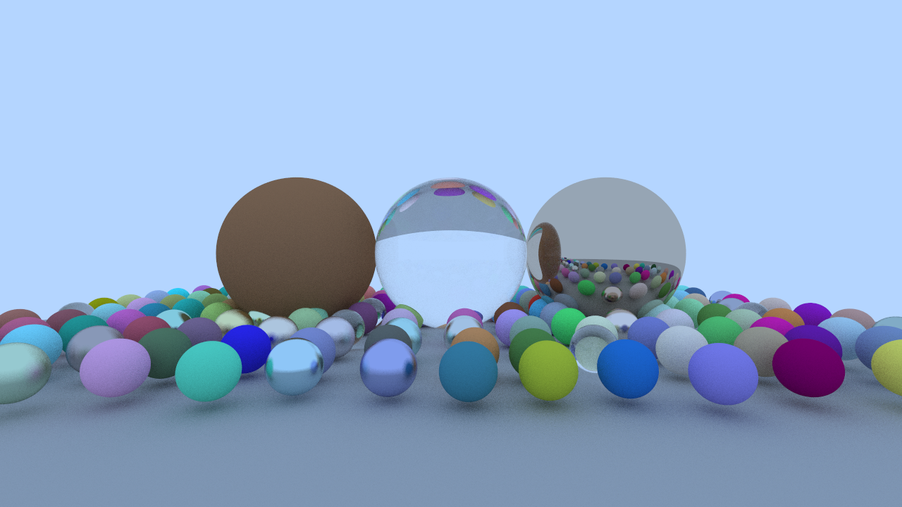
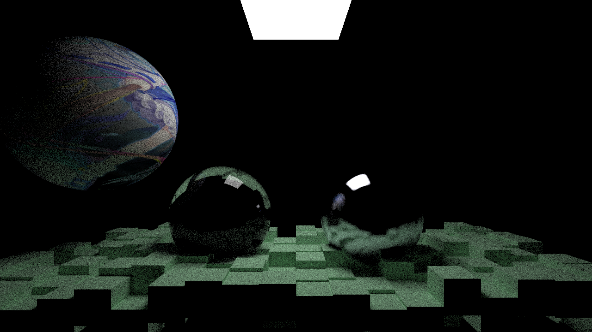
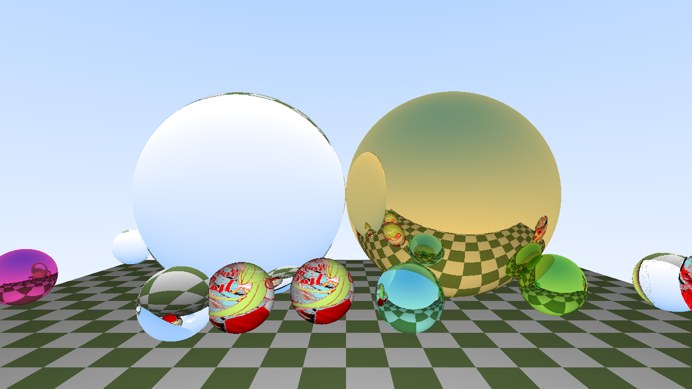
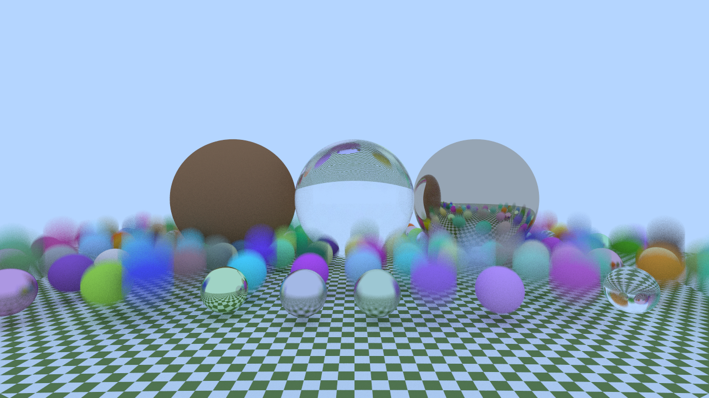
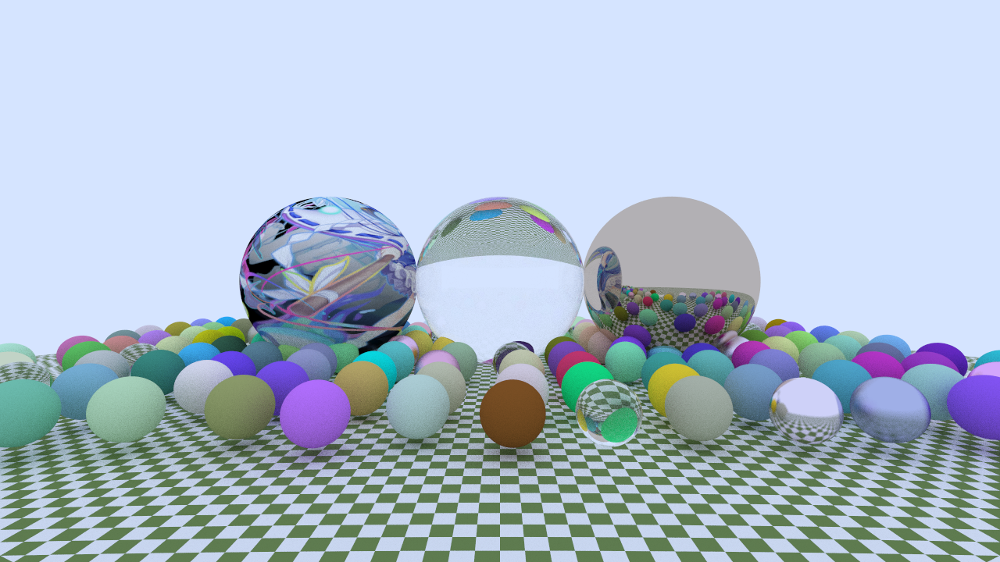
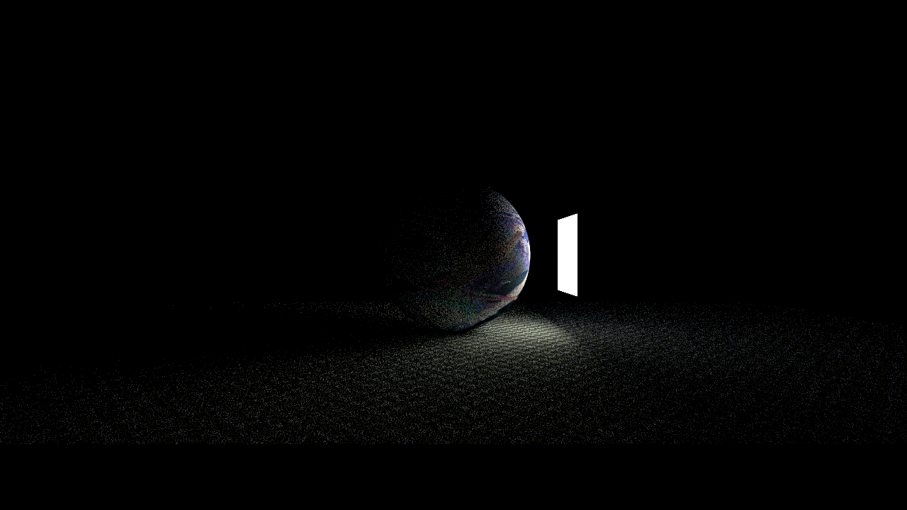
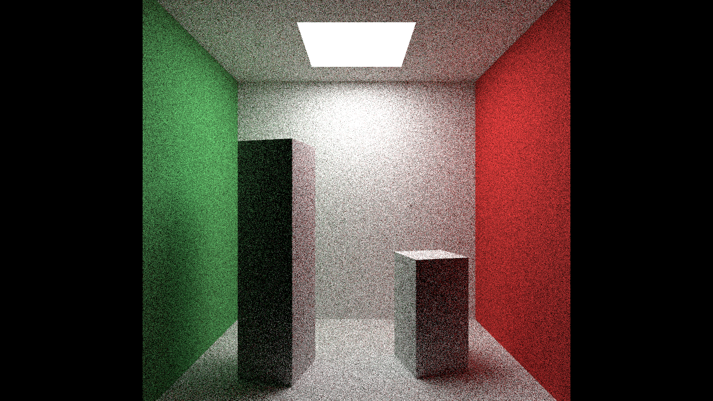

### Go 语言实现的光线追踪
#### 简单模式

> 分支：simple
>
> 参考：https://www.scratchapixel.com/lessons/3d-basic-rendering/introduction-to-ray-tracing/how-does-it-work.html
#### 复杂模式1

> 分支：book1
> 
> 参考：https://raytracing.github.io/books/RayTracingInOneWeekend.html
#### 复杂模式2

> 分支：book2
> 
> 参考：https://raytracing.github.io/books/RayTracingTheNextWeek.html
#### 其他测试

> 金属，玻璃，纹理

> 动态模糊

> 纹理测试

> 光照

> Cornell Box